# zbx-audit

Analisador de eventos Zabbix com coleta global, persistencia em PostgreSQL, baseline estatistico, auditoria de ambiente e suporte opcional a IA local (Ollama) com RAG de runbooks.

## Objetivo

O projeto centraliza o fluxo operacional de monitoracao:

1. Coletar eventos do Zabbix.
2. Persistir e organizar dados no PostgreSQL.
3. Detectar anomalias com baseline e z-score.
4. Gerar analises por grupo e auditoria de ambiente.
5. Apoiar investigacao com IA e conhecimento de runbooks.

## Estrutura Atual

```text
zbx-audit/
|-- app.py
|-- cli.py
|-- requirements.txt
|-- .env.example
|-- deploy/
|   |-- README_REMOTE.md
|   |-- nginx/
|   |-- streamlit/
|   `-- systemd/
|-- ai/
|   |-- ai.py
|   |-- ai_standard.py
|   |-- ollama_client.py
|   |-- rag_support.py
|   `-- runbook_indexer.py
|-- analyzer/
|   |-- analyzer.py
|   |-- baseline.py
|   |-- env_audit_report.py
|   `-- group_metrics_report.py
|-- db/
|   |-- db.py
|   |-- event_repository.py
|   |-- migrate_add_duration.py
|   `-- query_recovery_durations.py
|-- docs/
|   |-- fluxo_codigo_zbx_audit.md
|   `-- kb_acao_em_caso_de_alarme.md
|-- shared/
|   |-- config.py
|   |-- logger_config.py
|   |-- models.py
|   |-- types_contracts.py
|   `-- utils.py
`-- zabbix/
    `-- zabbix_client.py
```

## Responsabilidade das Pastas

- deploy: artefatos de deploy remoto, servico e proxy reverso.
- ai: prompts, chamadas ao Ollama, RAG e indexacao de runbooks.
- analyzer: regras de negocio, analise de metricas e auditoria.
- db: conexao, schema, repositorio e scripts de suporte ao banco.
- zabbix: integracao com a API do Zabbix.
- shared: configuracao, logging, contratos e utilitarios reutilizaveis.
- docs: documentacao tecnica e base de conhecimento.

## Fluxo de Execucao (CLI)

1. Parse dos argumentos em cli.py.
2. Inicializacao do GroupZabbixAnalyzer.
3. Coleta global de eventos (ou pulo com --only-analyze).
4. Persistencia no PostgreSQL.
5. Calculo de baseline e metricas por grupo.
6. Opcional: auditoria de ambiente com --env-audit.
7. Opcional: analise IA com --with-ai ou --with-ai-toon.
8. Saida em logs e/ou arquivo de output.

## Requisitos

- Python 3.8+
- PostgreSQL 13+
- Zabbix com API habilitada
- Ollama (opcional)
- pgvector (opcional, para busca vetorial de runbooks)

## Instalacao

```bash
cd /caminho/para/zbx-audit
python -m venv .venv
source .venv/bin/activate
pip install -r requirements.txt
```

## Configuracao

```bash
cp .env.example .env
```

Variaveis obrigatorias:

```bash
ZABBIX_URL=https://seu-zabbix
ZABBIX_USER=seu_usuario
ZABBIX_PASSWORD=sua_senha
DB_NAME=zabbix_events
DB_USER=zbx_user
DB_PASSWORD=sua_senha_db
```

Variaveis opcionais comuns:

```bash
DB_HOST=localhost
DB_PORT=5432
DB_POOL_MIN=2
DB_POOL_MAX=10
BATCH_SIZE=1000
OLLAMA_API_URL=http://localhost:11434/api/generate
OLLAMA_MODEL=phi3:mini
OLLAMA_TIMEOUT=600
LOG_LEVEL=INFO
```

## Comandos Principais

Analise padrao (coleta + analise):

```bash
python cli.py --group-name "Zabbix/Servico" --hours 24
```

Somente coleta:

```bash
python cli.py --group-name "IGNORADO" --only-collect --hours 24
```

Somente analise de dados ja coletados:

```bash
python cli.py --group-name "Zabbix/Servico" --only-analyze
```

Com IA (JSON):

```bash
python cli.py --group-name "Zabbix/Servico" --with-ai
```

Com IA em TOON:

```bash
python cli.py --group-name "Zabbix/Servico" --with-ai-toon --format-toon
```

Com fonte externa Notification Hub (isolada e opcional):

```bash
python cli.py \
    --group-name "Operação Vídeos" \
    --only-analyze \
    --with-notification-hub \
    --notification-hub-cookie "_info=...; _id=..." \
    --notification-hub-start-date 2026-03-01 \
    --notification-hub-end-date 2026-03-31 \
    --notification-hub-team "Operação Vídeos"
```

Se não usar cookie de sessão, use autenticação por token com `--notification-hub-email` e `--notification-hub-secret`.

Auditoria de ambiente:

```bash
python cli.py --group-name "Zabbix/Servico" --only-analyze --env-audit --with-ai
```

Estatisticas do banco:

```bash
python cli.py --group-name "Zabbix/Servico" --show-stats
```

Limpeza do banco:

```bash
python cli.py --group-name "Zabbix/Servico" --clear-db
python cli.py --group-name "Zabbix/Servico" --clear-db --force-clear
```

Historico de IA:

```bash
python cli.py --group-name "Zabbix/Servico" --ai-history --ai-history-limit 20
```

## RAG de Runbooks

Indexar diretorio docs:

```bash
python cli.py --group-name "Zabbix/Servico" --index-runbooks --docs-dir ./docs
```

Indexar arquivo unico:

```bash
python cli.py --group-name "Zabbix/Servico" --index-runbook-file docs/kb_acao_em_caso_de_alarme.md
```

## Interface Web

```bash
streamlit run app.py
```

## Saidas Geradas

Arquivos comuns no diretorio logs:

- last_output.json ou last_output.toon
- env_audit_last_output.json ou env_audit_last_output.toon
- last_ai_prompt.txt
- zbx-audit.log
- zbx-audit-errors.log

## Tabelas no PostgreSQL

### 1. Tabela `events`

Armazena eventos coletados do Zabbix normalizados e enriquecidos com metricas.

**Schema:**

| Coluna | Tipo | Nullable | Constraint | Descricao |
|--------|------|----------|-----------|-----------|
| event_id | TEXT | NOT NULL | PRIMARY KEY | Identificador unico do evento (chave primaria) |
| timestamp | BIGINT | NOT NULL | — | Timestamp UNIX do evento |
| host_name | TEXT | NOT NULL | — | Nome do host monitorado |
| hostgroups | JSONB | NOT NULL | — | Grupos do host em formato JSON {group_id: group_name} |
| proxy_name | TEXT | NULL | — | Nome do proxy Zabbix (se aplicavel) |
| severity | INTEGER | NOT NULL | — | Nivel de severidade (0-5: info, warning, average, high, disaster) |
| problem_name | TEXT | NOT NULL | — | Descricao do problema |
| is_control_group | BOOLEAN | DEFAULT FALSE | — | Flag para identificar grupos de controle |
| correlation_window | TEXT | NULL | — | Janela temporal para correlacao (preserved) |
| event_status | TEXT | NULL | CHECK IN ('Problem', 'Recovery') | Status do evento: Problem ou Recovery |
| event_duration | INTEGER | NULL | CHECK >= 0 | Duracao em segundos (calculado entre Problem e Recovery) |
| r_eventid | TEXT | NULL | — | Recovery event_id (relacionamento com Recovery) |
| runbook_context | TEXT | NULL | — | Contexto recuperado do RAG |
| created_at | BIGINT | DEFAULT extract(epoch from now()) | — | Timestamp de criacao do registro |
| updated_at | BIGINT | DEFAULT extract(epoch from now()) | — | Timestamp de ultima atualizacao |

**Índices:**

```sql
CREATE INDEX idx_events_timestamp ON events(timestamp DESC);
CREATE INDEX idx_events_hostgroups_gin ON events USING gin(hostgroups);
CREATE INDEX idx_events_proxy ON events(proxy_name) WHERE proxy_name IS NOT NULL;
CREATE INDEX idx_events_severity ON events(severity);
CREATE INDEX idx_events_status ON events(event_status);
CREATE INDEX idx_events_duration ON events(event_duration) WHERE event_duration IS NOT NULL;
CREATE INDEX idx_events_composite ON events(timestamp, event_status, is_control_group);
```

**Constraints:**
- PRIMARY KEY: event_id
- CHECK: event_status IN ('Problem', 'Recovery')
- CHECK: event_duration >= 0
- Índice GIN em hostgroups para buscas eficientes

---

### 2. Tabela `ollama_response`

Historico de analises geradas pela IA (Ollama) com texto dos prompts e classificacoes.

**Schema:**

| Coluna | Tipo | Nullable | Constraint | Descricao |
|--------|------|----------|-----------|-----------|
| id | SERIAL | NOT NULL | PRIMARY KEY | Identificador unico (auto-incremento) |
| timestamp | BIGINT | DEFAULT extract(epoch from now()) | — | Timestamp UNIX da analise |
| groupname | TEXT | NOT NULL | — | Nome do grupo Zabbix analisado |
| response | TEXT | NOT NULL | — | Resposta completa da IA (limitado a ~2-4KB) |
| ai_prompt | TEXT | NULL | — | Prompt enviado ao Ollama (full context) |
| model | TEXT | NULL | — | Modelo Ollama utilizado (ex: phi3:mini) |
| classification | TEXT | NULL | — | Classificacao gerada (ex: Critical, Major, Minor) |
| risk_level | TEXT | NULL | — | Nivel de risco (ex: High, Medium, Low) |
| main_problem | TEXT | NULL | — | Problema principal identificado |
| summary | TEXT | NULL | — | Resumo executivo da analise |
| recommended_actions | JSONB | NULL | — | Acoes recomendadas em estrutura JSON |
| metrics_snapshot | JSONB | NULL | — | Snapshot das metricas no momento da analise |
| created_at | TIMESTAMPTZ | DEFAULT NOW() | — | Timestamp de criacao (timezone-aware) |

**Índices:**

```sql
CREATE INDEX idx_ollama_groupname ON ollama_response(groupname, timestamp DESC);
```

**Constraints:**
- PRIMARY KEY: id (SERIAL)
- NOT NULL: groupname, response
- Índice composto em (groupname, timestamp DESC) para recuperacao rapida de historico

---

### 3. Tabela `runbooks`

Chunks de arquivos Markdown com embeddings vetoriais para RAG (Retrieval-Augmented Generation). Requer extensao pgvector.

**Schema:**

| Coluna | Tipo | Nullable | Constraint | Descricao |
|--------|------|----------|-----------|-----------|
| id | SERIAL | NOT NULL | PRIMARY KEY | Identificador unico (auto-incremento) |
| group_name | TEXT | NULL | — | Grupo Zabbix associado |
| source_path | TEXT | NOT NULL | — | Caminho do arquivo Markdown original |
| title | TEXT | NULL | — | Titulo do documento |
| chunk_index | INTEGER | NOT NULL | DEFAULT 0 | Indice do chunk dentro do arquivo |
| content | TEXT | NOT NULL | — | Conteudo do chunk (paragrafo/secao) |
| embedding | vector(768) | NOT NULL | — | Embedding vetorial (768 dimensoes, modelo sentence-transformers) |
| content_hash | TEXT | NOT NULL | — | Hash SHA-256 do conteudo (deteccao de duplicatas) |
| created_at | TIMESTAMPTZ | DEFAULT NOW() | — | Timestamp de criacao (timezone-aware) |
| updated_at | TIMESTAMPTZ | DEFAULT NOW() | — | Timestamp de ultima atualizacao |

**Índices:**

```sql
CREATE INDEX idx_runbooks_source ON runbooks(source_path, chunk_index);
CREATE INDEX idx_runbooks_group ON runbooks(group_name);
```

**Constraints:**
- PRIMARY KEY: id (SERIAL)
- UNIQUE(source_path, chunk_index): evita chunks duplicados no mesmo arquivo
- NOT NULL: source_path, content, embedding, content_hash
- Extensao pgvector REQUERIDA (CREATE EXTENSION vector;)

**Exemplo de Embedding:**
- Modelo: sentence-transformers (768 dims)
- Similaridade: cosine distance em queries vetoriais
- Uso: `SELECT * FROM runbooks ORDER BY embedding <=> query_vector LIMIT 5;`

---

### Conexoes Logicas entre Tabelas

```
events ──┐
         ├─ Gera analises ──> ollama_response
         └─ Recupera contexto > runbooks (via embedding vector)
```

- Um evento pode ter multiplas respostas IA (1:N)
- Um runbook chunk pode informar multiplos eventos (1:N)
- Ligacao via: correlacao texto do problema com conteudo dos chunks

### Performance e Tamanho

**Estimativas por milhao de registros:**

- events: ~500 MB (com JSONB)
- ollama_response: ~5 GB (respostas textuais grandes)
- runbooks: ~2 GB (embeddings vetoriais 768-dim)

## Troubleshooting Rapido

Erro de variaveis obrigatorias:

- Revisar .env e validar campos obrigatorios.

Erro de conexao PostgreSQL:

```bash
psql -h localhost -U zbx_user -d zabbix_events
```

Erro de sintaxe em modulo:

```bash
python -m py_compile analyzer/analyzer.py
```

Ollama indisponivel:

```bash
ollama serve
curl http://localhost:11434/
```

## Diagrama do fluxo de funcionamento do código

```mermaid
flowchart TD
    A["Inicio<br/>CLI / App / Rotina"] --> B{"Modo de execucao?"}

    B -->|only-collect| C["Coleta no Zabbix<br/>ultimas N horas"]
    B -->|only-analyze| G["Leitura no PostgreSQL<br/>dados ja persistidos"]
    B -->|fluxo completo| C

    C --> D["Normalizacao dos eventos<br/>host, hostgroups, proxy, severity,<br/>problem/recovery, correlation_window"]
    D --> E["Correlacao Problem/Recovery<br/>calculo de event_duration quando aplicavel"]
    E --> F["UPSERT em events<br/>PostgreSQL"]

    F --> H{"only-collect?"}
    H -->|sim| Z1["Fim<br/>coleta concluida"]
    H -->|nao| G

    G --> I{"Tipo de analise?"}

    I -->|Metricas por Grupo| J["Calcula metricas estruturadas do grupo<br/>top problems, top hosts, proxy analysis,<br/>critical events, baseline"]
    I -->|Env-Audit| K["Calcula metricas estruturadas do ambiente<br/>24h vs 30d, proxies_top_anomalies,<br/>proxies_last_hour, active_events"]

    J --> L["Baseline do grupo<br/>30 dias, medias, desvios,<br/>critical ratio, distribuicao"]
    L --> M["Deteccao de anomalias do grupo<br/>z-score, anomaly_score,<br/>novos problemas, proxy anomalies"]

    M --> N["Montagem deterministica parcial<br/>secao 1 + secao 2.2<br/>selecao de candidatos"]
    N --> O{"with-ai?"}

    K --> P["Montagem deterministica parcial<br/>secao 1 + secao 2.2 + secao 3<br/>selecao de proxy_candidates"]
    P --> Q["Busca RAG opcional<br/>runbook query + match relevante"]
    Q --> R{"with-ai?"}

    O -->|nao| S["Output estruturado<br/>JSON / TOON / tela"]
    R -->|nao| S

    O -->|sim| T["IA Grupo - Prompt 1<br/>gera apenas 2.1"]
    T --> U["IA Grupo - Prompt 2<br/>gera apenas 3 + Resumo"]
    U --> V["Montagem final do relatorio do grupo"]

    R -->|sim| W["IA Env-Audit - Prompt 1<br/>gera apenas 2.1"]
    W --> X["IA Env-Audit - Prompt 2<br/>gera apenas 4 + Resumo<br/>com RAG se houver match"]
    X --> Y["Montagem final do relatorio do ambiente"]

    V --> AA["Salva em ollama_response<br/>prompt concatenado + response<br/>classificacao + summary + snapshot"]
    Y --> AA

    AA --> S
    S --> Z["Fim"]

    style A fill:#90EE90
    style Z fill:#90EE90
    style Z1 fill:#90EE90

    style C fill:#FFE4B5
    style D fill:#FFE4B5
    style E fill:#FFE4B5
    style F fill:#E6F2FF

    style J fill:#F0E6FF
    style K fill:#F0E6FF
    style L fill:#F0E6FF
    style M fill:#F0E6FF
    style N fill:#F0E6FF
    style P fill:#F0E6FF
    style Q fill:#FFFACD

    style T fill:#FFFACD
    style U fill:#FFFACD
    style W fill:#FFFACD
    style X fill:#FFFACD

    style V fill:#E6FFE6
    style Y fill:#E6FFE6
    style AA fill:#E6F2FF
    style S fill:#FFE4E1

    style B fill:#FFF8DC
    style H fill:#FFF8DC
    style I fill:#FFF8DC
    style O fill:#FFF8DC
    style R fill:#FFF8DC

```


