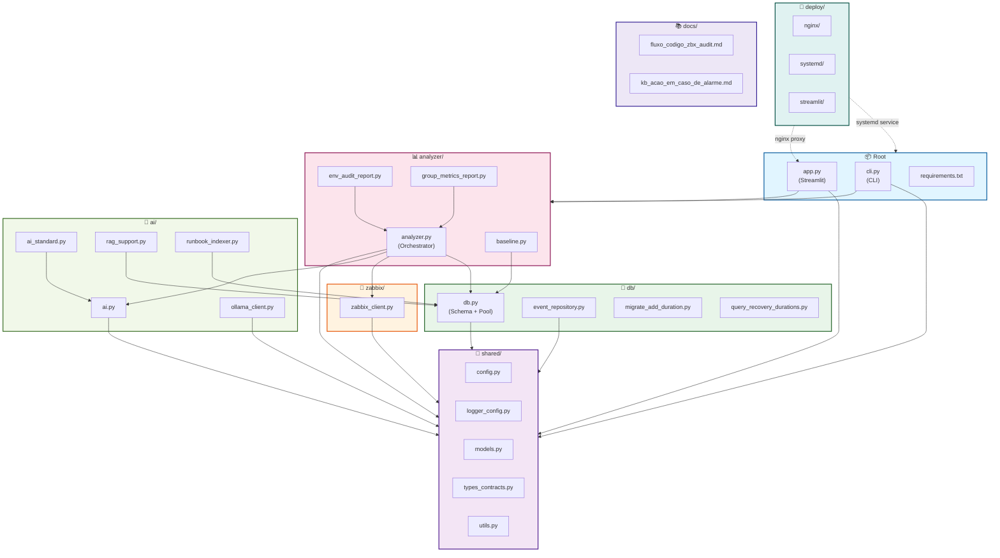

# Arquitetura Modular - zbx-audit

## Visão Geral da Estrutura

Este documento descreve a organização modular do projeto após refatoração em 7 pacotes lógicos.

## Diagrama de Dependências



---

## Descrição dos Módulos

### 📦 Root Level

**Arquivos:**
- `app.py`: Interface Streamlit para dashboard de métricas e histórico IA
- `cli.py`: Entry point CLI com 18+ subcomandos (--with-ai, --env-audit, etc.)
- `requirements.txt`: Dependências Python

**Responsabilidade:**
- Prover pontos de entrada (CLI e Web UI)
- Orquestrar fluxo completo da aplicação

---

### 🔧 shared/

**Arquivos:**
- `config.py`: Variáveis de ambiente (ZABBIX_*, DB_*, OLLAMA_*)
- `logger_config.py`: Setup de logging com rotação e fallback
- `models.py`: Dataclasses (EventData, MetricsData, AIResponse)
- `types_contracts.py`: Type hints e protocolos
- `utils.py`: Funções utilitárias (JSON, TOON, conversão de dados)

**Responsabilidade:**
- **Infra compartilhada** usada por todos os módulos
- Centralizar configurações, logging e tipos de dados
- Garantir consistência contratual entre módulos

**Dependências:** Nenhuma (puro)

---

### 📡 zabbix/

**Arquivos:**
- `zabbix_client.py`: Wrapper da API Zabbix via pyzabbix

**Responsabilidade:**
- Coletar eventos e informações de hosts/grupos do Zabbix
- Filtrar por timespan, grupos de controle e hosts
- Retornar eventos normalizados

**Dependências:** 
- `shared.config` (credenciais)
- `shared.logger_config`
- `pyzabbix`

---

### 💾 db/

**Arquivos:**
- `db.py`: ThreadedConnectionPool, schema creation, índices
- `event_repository.py`: UPSERT pattern para eventos (Problem/Recovery matching)
- `migrate_add_duration.py`: Script para calcular event_duration
- `query_recovery_durations.py`: Query auxiliar para debugging

**Responsabilidade:**
- Gerenciar conexões com PostgreSQL (pooling)
- Criar e manter schema das 3 tabelas (events, ollama_response, runbooks)
- Persistir eventos normalizados com correlação Problem↔Recovery
- Suportar queries para análise

**Dependências:**
- `shared.config` (credenciais DB)
- `shared.logger_config`
- `psycopg2`

---

### 📊 analyzer/

**Arquivos:**
- `analyzer.py`: Orchestrador central (GroupZabbixAnalyzer)
- `baseline.py`: Cálculo de baseline 30-dias + z-score
- `env_audit_report.py`: Auditoria de ambiente (packages, configs, etc.)
- `group_metrics_report.py`: Geração de relatório estruturado

**Responsabilidade:**
- Orquestrar fluxo completo: coleta → persistência → cálculo de métricas
- Detectar anomalias com baseline estatístico
- Gerar relatórios e análises por grupo
- Coordenar todas as dependências

**Dependências:**
- Todos os outros módulos (shared, db, zabbix, ai)
- Ponto central de coordenação

---

### 🤖 ai/

**Arquivos:**
- `ai.py`: Base OllamaAnalyzer com prompts e parsing JSON
- `ai_standard.py`: Extensão com reports estruturados
- `ollama_client.py`: HTTP wrapper para Ollama
- `rag_support.py`: Embedding vetorial (sentence-transformers)
- `runbook_indexer.py`: Chunking de Markdown → embeddings

**Responsabilidade:**
- Integração com LLM local (Ollama)
- RAG pattern: retrieve chunks de runbooks baseado em embedding
- Análise de anomalias com contexto de documentação
- Gerar classificações, risks e ações recomendadas

**Dependências:**
- `shared.config` (OLLAMA_API_URL, modelo)
- `db` (query runbooks embeddings)
- `requests`, `sentence-transformers`

---

### 🚀 deploy/

**Arquivos:**
- `systemd/`: Configuração de serviço systemd
- `nginx/`: Configuração de reverse proxy
- `streamlit/`: Config de streaming

**Responsabilidade:**
- Prover artefatos de deploy em ambiente remoto
- Configurar serviço como daemon
- Configurar proxy reverso
- README_REMOTE.md com instruções passo-a-passo

---

### 📚 docs/

**Arquivos:**
- `fluxo_codigo_zbx_audit.md`: Documentação do fluxo de integração
- `kb_acao_em_caso_de_alarme.md`: Base de conhecimento para runbooks
- `arquitetura_modular.md`: Este arquivo

**Responsabilidade:**
- Documentação técnica
- Base de conhecimento para RAG

---

## Fluxo de Execução Completo

```mermaid
graph TD
    A["🟢 Início<br/>CLI Parse Argumentos"] --> B{"Modo de<br/>Execução?"}
    
    B -->|--only-collect| C["📡 Coleta do Zabbix<br/>Busca eventos últimas N horas"]
    B -->|--only-analyze| D["💾 Lê dados já coletados<br/>PostgreSQL"]
    B -->|Padrão| C
    
    C --> E["🔄 Normaliza Eventos<br/>event_id, timestamp, severity,<br/>hostgroups, proxy_name"]
    
    E --> F["📝 Correlação Problem/Recovery<br/>Agrupa Problem com Recovery<br/>Calcula event_duration"]
    
    F --> G["💾 UPSERT no PostgreSQL<br/>Insere/atualiza events"]
    
    G --> H{"--only-collect?"}
    H -->|Sim| Z1["✅ Fim<br/>Dados persistidos"]
    H -->|Não| D
    
    D --> I["📊 Calcula Baseline<br/>Ultimos 30 dias<br/>Media, desvio-padrão per group"]
    
    I --> J["📈 Z-Score Analysis<br/>Detecta anomalias<br/>severity vs baseline"]
    
    J --> K["📋 Gera Relatório de Métricas<br/>Total eventos, severidades,<br/>hosts afetados, problemas top"]
    
    K --> L{"--env-audit?"}
    L -->|Sim| M["🔍 Auditoria de Ambiente<br/>Verifica packages, versões,<br/>configs, patches"]
    L -->|Não| N{"--with-ai?"}
    
    M --> N
    
    N -->|Não| O["📄 Output Final<br/>JSON / TOON / Logs"]
    N -->|Sim| P["🤖 Chama Ollama<br/>Envia prompt com contexto<br/>eventos + baseline + metricas"]
    
    P --> Q["🔍 RAG Retrieval<br/>Busca chunks similares<br/>nos runbooks via embedding"]
    
    Q --> R["📚 Augment Prompt<br/>Adiciona contexto dos runbooks<br/>ao prompt original"]
    
    R --> S["🧠 Ollama Analisa<br/>Genera classificação,<br/>risco, acoes recomendadas"]
    
    S --> T["💾 Salva Resposta IA<br/>ollama_response table<br/>prompt + response + classificação"]
    
    T --> O
    
    O --> U{"Saída foi<br/>sucesso?"}
    U -->|Sim| Z["✅ Fim<br/>Análise Completa"]
    U -->|Não| Z2["❌ Erro<br/>Verificar logs"]
    
    style A fill:#90EE90
    style Z fill:#90EE90
    style Z1 fill:#90EE90
    style Z2 fill:#FFB6C6
    
    style C fill:#FFE4B5
    style D fill:#E6F2FF
    style E fill:#FFE4B5
    style F fill:#FFE4B5
    style G fill:#E6F2FF
    
    style I fill:#F0E6FF
    style J fill:#F0E6FF
    style K fill:#F0E6FF
    
    style M fill:#E6FFE6
    style P fill:#FFFACD
    style Q fill:#FFFACD
    style R fill:#FFFACD
    style S fill:#FFFACD
    style T fill:#E6F2FF
    
    style O fill:#FFE4E1
    style B fill:#FFF8DC
    style H fill:#FFF8DC
    style L fill:#FFF8DC
    style N fill:#FFF8DC
    style U fill:#FFF8DC
```



---

## Detalhamento de Cada Etapa

### 1️⃣ Parse de Argumentos (cli.py)

**O que faz:**
```bash
python cli.py --group-name "Zabbix/Servico" --hours 24 --with-ai
```

Argumentos principais:
- `--group-name`: Qual grupo Zabbix analisar
- `--hours`: Timespan de coleta (default 24h)
- `--only-collect`: Só coleta, sem análise
- `--only-analyze`: Só análise com dados já coletados
- `--with-ai`: Ativa análise IA (Ollama)
- `--env-audit`: Auditoria de ambiente
- `--show-stats`: Exibe estatísticas do banco

---

### 2️⃣ Coleta do Zabbix (zabbix/zabbix_client.py)

**O que faz:**

```python
# zabbix_client.py
collector = ZabbixCollector(url, user, password)
events = collector.get_events_batch(
    hostgroups=["Zabbix/Servico"],
    hours=24,
    limit=1000
)
```

**Transformação:**
```json
Zabbix Event → EventData(
    event_id: "12345",
    timestamp: 1711910400,
    host_name: "srv-prod-01",
    hostgroups: {"10": "Zabbix/Servico"},
    severity: 4,
    problem_name: "CPU > 80%",
    proxy_name: "proxy-datacenter"
)
```

**Filtros aplicados:**
- Ultimas N horas
- Grupos de controle excluídos (se marcado)
- Status: Problem + Recovery

---

### 3️⃣ Normalização (analyzer/analyzer.py)

**O que faz:**

- Valida tipos de dados (timestamp UNIX, severity 0-5)
- Limpa valores nulos
- Enriquece com metadata (is_control_group flag)
- Formata hostgroups em JSONB

**Entrada:**
```python
raw_events = [Event(id="123", ts=1711910400, severity=4, ...)]
```

**Saída:**
```python
normalized = [EventData(event_id="123", timestamp=1711910400, ...)]
```

---

### 4️⃣ Correlação Problem/Recovery (db/event_repository.py)

**O que faz:**

Agrupa eventos de **problema** com seu correspondente **recuperação**:

```
Problem Event (t=1711910400, severity=4)
   ↓
   ├─ Status: "Problem"
   ├─ Storage: events table
   └─ Wait for Recovery...
          ↓
Recovery Event (t=1711914000)
   ├─ Status: "Recovery"  
   ├─ r_eventid: <problem_event_id>
   └─ Calcula: event_duration = 1711914000 - 1711910400 = 3600 segundos
```

**SQL Pattern:**
```sql
INSERT INTO events (event_id, timestamp, severity, event_status, ...)
VALUES (...)
ON CONFLICT (event_id) DO UPDATE SET
    r_eventid = EXCLUDED.r_eventid,
    event_status = EXCLUDED.event_status,
    event_duration = EXCLUDED.event_duration,
    updated_at = EXCLUDED.updated_at
```

---

### 5️⃣ Cálculo de Baseline (analyzer/baseline.py)

**O que faz:**

Para cada grupo, calcula estatísticas dos últimos **30 dias**:

```python
# Ultimos 30 dias
baseline_data = [
    {"timestamp": t, "severity": s, "event_count": c},
    ...
]

# Calcula
mean_severity = np.mean([s for _, s, _ in baseline_data])
std_severity = np.std([s for _, s, _ in baseline_data])

# Resultado
baseline = {
    "mean": 2.3,
    "std": 1.1,
    "q25": 1.0,
    "q75": 3.5,
    "total_events_30d": 1542
}
```

---

### 6️⃣ Detecção de Anomalias - Z-Score (analyzer/baseline.py)

**O que faz:**

Compara severidade atual vs histórico 30-dias:

```python
current_severity = 4  # Crítico
baseline_mean = 2.3
baseline_std = 1.1

z_score = (current_severity - baseline_mean) / baseline_std
# z_score = (4 - 2.3) / 1.1 = 1.54

# Interpretação
if |z_score| > 2.0:  # 2 standard deviations
    anomaly_level = "HIGH"
    
if |z_score| > 3.0:  # 3 standard deviations
    anomaly_level = "CRITICAL"
```

---

### 7️⃣ Geração de Relatório (analyzer/group_metrics_report.py)

**O que faz:**

Consolida métricas em estrutura legível:

```json
{
  "group_name": "Zabbix/Servico",
  "period_hours": 24,
  "total_events": 342,
  "by_severity": {
    "0_info": 120,
    "1_warning": 150,
    "2_average": 50,
    "3_high": 20,
    "4_disaster": 2
  },
  "affected_hosts": ["srv-prod-01", "srv-prod-02"],
  "top_problems": [
    {"problem": "CPU > 80%", "count": 45},
    {"problem": "Memory high", "count": 32}
  ],
  "baseline": {
    "mean_severity": 2.3,
    "anomaly_score": 1.54
  }
}
```

---

### 8️⃣ Auditoria de Ambiente (analyzer/env_audit_report.py)

**O que faz (se --env-audit):**

Verifica estado do host:
- Python version
- Packages instalados
- Disk space
- Memory usage
- Running services
- SSH config
- Firewall rules

---

### 9️⃣ Análise com IA (ai/ai.py → ollama_client.py)

**O que faz (se --with-ai):**

1. **Monta o Prompt:**
```
Você é um especialista SRE. Analise este evento crítico:

CONTEXTO:
- Grupo: Zabbix/Servico
- Problema: CPU > 80% em srv-prod-01
- Duração: 3600 segundos
- Severidade: Crítica (4/5)
- Eventos similares últimas 24h: 45

BASELINE 30-DIAS:
- Média: 2.3
- Anomaly Score: z=1.54 (ALTO)

RUNBOOKS SIMILARES:
- Procedimento: "O que fazer quando CPU > 80%"
- Ações: Verificar processos, aumentar recursos, alertar DevOps

Qual é sua análise e recomendações?
```

2. **Envia para Ollama:**
```python
response = ollama_client.generate(
    model="phi3:mini",
    prompt=prompt,
    timeout=600
)
```

3. **Parse Resposta:**
```
classification: "Critical"
risk_level: "High"
main_problem: "CPU excessiva em srv-prod-01"
summary: "Processo fork bomb detectado, reiniciar aplicação"
recommended_actions: ["Restart app", "Increase CPU limit"]
```

---

### 🔟 RAG - Retrieval Augmented Generation (ai/rag_support.py)

**O que faz (se --with-ai):**

1. **Cria embedding do prompt:**
```python
# Converte texto para vetor 768-dimensões
prompt_vector = sentence_transformer.encode(
    "CPU > 80% em servidor"
)
```

2. **Busca chunks similares nos runbooks:**
```sql
SELECT content, title
FROM runbooks
ORDER BY embedding <=> prompt_vector
LIMIT 5
```

3. **Augmenta prompt com contexto:**
```
Conhecimento adicional:
- Documento: "Troubleshooting CPU"
- "1. Verificar 'top' para processos pesados
- 2. Analisar system load..."
```

---

### 1️⃣1️⃣ Output Final

**Formatos suportados:**

**JSON:**
```bash
python cli.py --with-ai > last_output.json
# Salva estrutura completa
```

**TOON (Table for Operation Ops Notes):**
```bash
python cli.py --with-ai --format-toon > last_output.toon
# Formato legível para SREs
```

**Logs:**
```
2026-04-01 14:23:45 [INFO] Coletados 342 eventos
2026-04-01 14:24:12 [INFO] Baseline calculado: mean=2.3, std=1.1
2026-04-01 14:24:15 [INFO] Anomalias detectadas: 5 eventos com z>2.0
2026-04-01 14:25:00 [INFO] Análise IA concluída
```

---

## Import Pattern

Todos os arquivos seguem o padrão:

```python
import sys
from pathlib import Path

sys.path.insert(0, str(Path(__file__).parent.parent))

from shared.config import ...
from db.db import ...
```

**Ajustamentos de `sys.path` por nível:**
- Do root (app.py, cli.py): `sys.path.insert(0, str(Path(__file__).parent))`
- De subpastas (ex: analyzer/): `sys.path.insert(0, str(Path(__file__).parent.parent))`

---

## Dependency Injection Implícita

- **config**: Shared globalmente via `shared.config`
- **logger**: Shared globalmente via `LoggerSetup.get_logger(__name__)`
- **DB pool**: Lazy initialization via `get_db_connection()`
- **Models**: Contracts via `shared.models` (EventData, etc.)

---

## Estratégia de Testes

1. **Unit tests** no nível do módulo (ex: `tests/analyzer/test_baseline.py`)
2. **Integration tests** orquestrando múltiplos módulos
3. **Mock** de Zabbix API e Ollama para CI/CD
4. **Fixtures** compartilhadas em `tests/conftest.py`

---

## Performance & Escalabilidade

- **Connection pool**: 2-10 conexões (tunable via `.env`)
- **Batch size**: 1000 eventos por insert (tunable)
- **RAG**: Vector search em ~50ms (pgvector)
- **Ollama**: Timeout configurável (default 600s)

---

## Próximos Passos de Evolução

- [ ] Migrate do pgvector para Milvus (distribuído)
- [ ] Suportar múltiplos modelos LLM (não só Ollama)
- [ ] Async/await pattern para coleta paralela
- [ ] Prometheus metrics (latency, eventos coletados, etc.)
- [ ] Webhook para eventos críticos (Slack, Teams)
