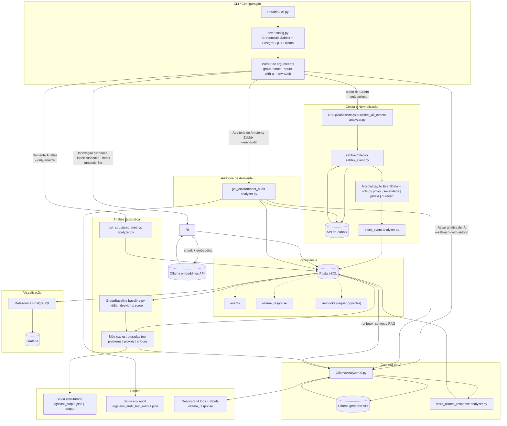

# Fluxo de dados do `zbx-audit`

Este diagrama mostra **de onde os dados saem**, **como são processados** e **onde ficam armazenados**.

## Resumo rápido

- **Origem dos dados principais:** API do Zabbix (`event.get`, `host.get`, `problem.get`).
- **Configuração de acesso:** arquivo `.env` lido por `config.py`.
- **Processamento:** normalização dos eventos em `EventData`, cálculo de métricas e baseline (`analyzer.py` + `baseline.py`).
- **Armazenamento principal:** PostgreSQL nas tabelas `events`, `ollama_response` e `runbooks`.
- **IA (opcional):** `ai.py` envia métricas para Ollama e grava o retorno em `ollama_response`.
- **Saídas finais:** arquivos em `logs/` e/ou arquivo passado em `--output` (JSON ou TOON).
